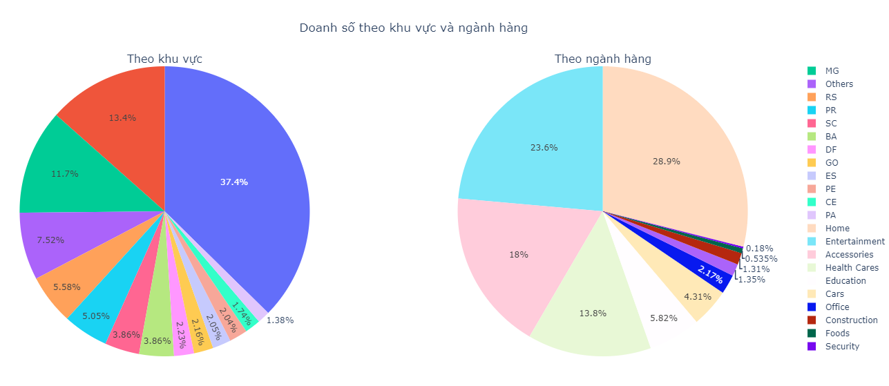
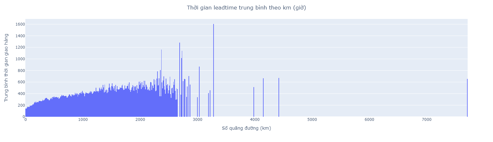

# Dữ liệu đầu vào
```
https://drive.google.com/file/d/1R6TFr2aCmouWRQx8LoxZFrw4TF2lj7K3/view?usp=sharing
```
# Mục tiêu
Tăng đối đa tổng giá trị (GMV) của công ty và tối ưu hóa chi phí
# Nội dung
## Báo cáo doanh số
1) Doanh số theo khu vực
2) Doanh số theo ngành hàng
3) Doanh số theo tháng
## Báo cáo chi phí 
1) Phân bổ chi phí theo số lượng đơn
2) Phân bố chi phí và quãng đường vận chuyển
3) Tỷ trọng Freight cost so với Item cost
## Báo cáo leadtime (tình hình đặt hàng từ lúc order, dự kiến thời gian giao hàng cho khách)
1) Thời gian theo dõi đặt hàng bình quân
2) Leadtime đặt hàng theo ngành hàng
3) Thời gian leadtime trung bình theo km
## Báo cáo review
Trọng số chấm điểm trên 3 điểm là positive (1), từ 3 điểm trở xuống là negative (0)
Do một đơn hàng có một/nhiều đánh giá, nên sẽ tính trung bình điểm đánh giá cho từng đơn hàng
* Tỷ trọng positive/negative
* Chấm điểm đơn hàng dựa trên thời gian giao hàng
* Đánh giá doanh thu theo ngành hàng phân loại theo điểm đánh giá

## Báo cáo khách hàng
1) Tỷ trọng khách hàng theo bang tính theo số lượng đơn và doanh thu
2) Tỷ lệ khách hàng mua lại (retention rate)

# EDA dữ liệu
## Khám phá dữ liệu (explore)

1) Bảng customers
* Dữ liệu không có giá trị null
* Có 5 trường thông tin
``` 
0   customer_id               99441 non-null  object
1   customer_unique_id        99441 non-null  object
2   customer_zip_code_prefix  99441 non-null  int64 
3   customer_city             99441 non-null  object
4   customer_state            99441 non-null  object
```
2) Bảng products
* Có 9 trường thông tin
* Cột "product_category_name" có giá trị NaN, nên tạm thời phân loại vào danh mục "Others"
```
 0   product_id                  32951 non-null  object 
 1   product_category_name       32951 non-null  object 
 2   product_name_lenght         32341 non-null  float64
 3   product_description_lenght  32341 non-null  float64
 4   product_photos_qty          32341 non-null  float64
 5   product_weight_g            32949 non-null  float64
 6   product_length_cm           32949 non-null  float64
 7   product_height_cm           32949 non-null  float64
 8   product_width_cm            32949 non-null  float64
```
3) Bảng geolocation
* Có 5 trường thông tin, không có giá trị NaN
* Trường "geolocation_zip_code_prefix" không unique, tạm thời dùng tọa độ average trung bình của kinh độ (lng) và vĩ độ (lat) để unique bảng
```
 0   geolocation_zip_code_prefix  1000163 non-null  int64  
 1   geolocation_lat              1000163 non-null  float64
 2   geolocation_lng              1000163 non-null  float64
 3   geolocation_city             1000163 non-null  object 
 4   geolocation_state            1000163 non-null  object 
```
4) Bảng sellers
* Có 4 trường thông tin, trường seller_id là unique
* Không có giá trị NaN
```
 0   seller_id               3095 non-null   object
 1   seller_zip_code_prefix  3095 non-null   int64 
 2   seller_city             3095 non-null   object
 3   seller_state            3095 non-null   object
```
5) Bảng orders
* Có 8 trường thông tin, có các giá trị NaN tùy thuộc vào "order_status"
* Trường "order_id" là unique
* Đơn hàng đặt không có thông tin sản phẩm, phải mapping từ order_items
```
 0   order_id                       99441 non-null  object
 1   customer_id                    99441 non-null  object
 2   order_status                   99441 non-null  object
 3   order_purchase_timestamp       99441 non-null  object
 4   order_approved_at              99281 non-null  object
 5   order_delivered_carrier_date   97658 non-null  object
 6   order_delivered_customer_date  96476 non-null  object
 7   order_estimated_delivery_date  99441 non-null  object
```
6) Bảng order_items
* Có 7 trường thông tin, mỗi đơn hàng "order_id" có 1 hoặc nhiều mã product/ seller_id
* Chi phí = Price + Freight_value
* Không có giá trị NaN trong bảng
```
 0   order_id             112650 non-null  object 
 1   order_item_id        112650 non-null  int64  
 2   product_id           112650 non-null  object 
 3   seller_id            112650 non-null  object 
 4   shipping_limit_date  112650 non-null  object 
 5   price                112650 non-null  float64
 6   freight_value        112650 non-null  float64
```
7) Bảng order_reviews
* Có 7 trường thông tin
* Trường "order_id" không unique
```
 0   review_id                100000 non-null  object        
 1   order_id                 100000 non-null  object        
 2   review_score             100000 non-null  int64         
 3   review_comment_title     11715 non-null   object        
 4   review_comment_message   41753 non-null   object        
 5   review_creation_date     100000 non-null  datetime64[ns]
 6   review_answer_timestamp  100000 non-null  datetime64[ns]
```
8) Bảng order_payments
* Có 5 trường thông tin
* Trường "order_id" không unique
```
 0   order_id              103886 non-null  object 
 1   payment_sequential    103886 non-null  int64  
 2   payment_type          103886 non-null  object 
 3   payment_installments  103886 non-null  int64  
 4   payment_value         103886 non-null  float64
```
## Báo cáo phân tích
**1) Báo cáo doanh số (Doanh số dựa trên giá và chi phí vận chuyển)**
* Doanh số theo tháng

Doanh số cơ bản tăng trưởng dương theo thời gian, mặc dù không phải số lũy kế, chứng minh tình hình triển vọng của công ty
* Doanh số theo khu vực và ngành hàng

- Về khu vực, bang SP có tỷ trọng doanh số lớn sau, sau đó lần lượt các bang RJ-MG. Các bang còn lại không có chênh lệch về doanh số
- Về ngành hàng, tỷ trọng doanh số đến từ ngành liên quan mua sắm nhà cửa chiếm nhiều nhất với hơn 28%, tiếp đến là giải trí (23,6%) và thời trang (18%), sau đó là giáo dục và chăm sóc sức khỏe và một số ngành lĩnh vực khác.
**2) Báo cáo chi phí (Chi phí dựa trên price và chi phí vận chuyển)**
* Phân bổ chi phí theo số lượng đơn

Về cơ bản, chi phí (giá bán) tập trung cho đơn hàng khoảng từ 0-200, và những đơn hàng có giá từ 100-200 chỉ bằng khoảng 50% so với đơn hàng 0-100.
* Phân bố chi phí và quãng đường vận chuyển

Mức độ giảm dần về chi phí khi so sánh tương đối với quãng đường được liệt kê như sau:
```
Entertainment, Health cares, Home, Accessories, Education, Office, Foods, Construction, Cars, Others, Security
```
Chi phí phát sinh liên quan đến (Foods, Construction, Cars, Others, Security) thì khách hàng thường mua gần nhà. Còn chi tiêu cho (Entertainment, Health cares, Home, Accessories) thì khách hàng ít chú trọng hơn về khoảng cách
* Tỷ trọng Freight cost so với Item cost

Về cơ bản, khi giá price tăng thì có xu hướng chi phí vận chuyển tăng.
Ngoài ra, chi phí vận chuyển chủ yếu dưới $100 đô, cho các đơn hàng dưới $1000. 
**3) Báo cáo leadtime (tình hình đặt hàng từ lúc order, dự kiến thời gian giao hàng cho khách)**
* Thời gian theo dõi đặt hàng bình quân (giờ)

Theo thống kê, thời gian khách ấn đặt hàng đến lúc hệ thống xác nhận đơn trung bình là 9 tiếng, khá là chậm khi so với công nghệ hiện nay.
Thời gian từ lúc xác nhận đơn đến khi giao cho bên vận chuyển trung bình mất 68 tiếng tương ứng 2,8 ngày. 
Thời gian vận chuyển đến khi giao đến tay khách là 228 tiếng tương ứng 9,5 ngày.
Tổng thời gian trung bình là 306 tiếng tương ứng 12,75 ngày. Con số này khá cao, khi sản phẩm mang giá trị doanh số cao đến từ ngành (Home, Entertainment, Accessories), là những ngành hàng có tốc độ lưu chuyển nhanh vì sản phẩm đa dạng và dễ vận chuyển.
* Leadtime đặt hàng theo ngành hàng

Thời gian đặt đơn đến lúc duyệt đơn khá đều giữa các ngành, tuy nhiên lâu nhất là Security và Office
Thời gian duyệt đơn đến lúc giao vận chuyển, cao nhất là ngành Office, còn các ngành còn lại khá đồng đều
Thời gian vận chuyển đến lúc về tay khách hàng, có sự đồng đều giữa các ngành, trung bình khoảng 9,5 ngày
* Thời gian leadtime trung bình theo km

Về cơ bản, có xu hướng tăng dần giữa quãng đường và tổng thời gian giao hàng tính từ lúc đặt đơn đến khi giao thành công.
Tổng thời gian trung bình giao hàng vào khoảng 140-400 giờ cho các đơn hàng dưới 2700km
**4) Báo cáo review**
* Tỷ trọng positive/negative

Tỷ trọng số đơn hàng chấm điểm tích cực là 75%
* Chấm điểm đơn hàng dựa trên thời gian giao hàng

Nhìn biểu đồ, có thể thấy đơn hàng giao nhanh sẽ mang lại đánh giá tích cực từ phía khách hàng, chưa đánh giá yếu tố chất lượng sản phẩm; mặc dù vẫn có vài đơn hàng giao lâu, giá tiền thấp nhưng khách hàng vẫn chấm điểm tốt.
Còn thời gian giao hàng từ 800 - 2000 giờ tương ứng 1 hay nhiều tháng, hầu hết sẽ đánh giá tiêu cực.
Như vậy, cần có chiến lược về thay đổi cách thức giao hàng để tăng tỷ lệ kéo giữ khách hàng.
* Đánh giá doanh thu theo ngành hàng phân loại theo điểm đánh giá

Doanh số ngành hàng (Home, Entertainment,Accessories) nằm top 3 nhưng mức độ tương đối giữa doanh số từ đánh giá tiêu cực đang chiếm khoảng hơn 1/3 so với doanh số từ đánh giá tích cực.
**5) Báo cáo khách hàng**
* Tỷ trọng khách hàng theo bang tính theo số lượng đơn và doanh thu

Tỷ trọng khách hàng từ các bang (SP,RJ,MG) chiếm tỷ trọng trên 60% tổng khách hàng của công ty, với cao nhất là bang SP với tỷ trọng trên 35%.

* Tỷ lệ khách hàng mua lại (retention rate)

Tỷ lệ khách hàng quay lại mua khoảng 10%

Đối với top 3 bang có số lượng khách hàng cao nhất, thì tỷ lệ mua lần 2 trở lên là khoảng 10%. Bang AL có tỷ lệ quay lại thấp nhất là 5,84% và bang AP có tỷ lệ cao nhất là 14,71% là 2 bang nằm trong thiểu số các bang có số khách hàng mua thấp (phân loại vào Others).

